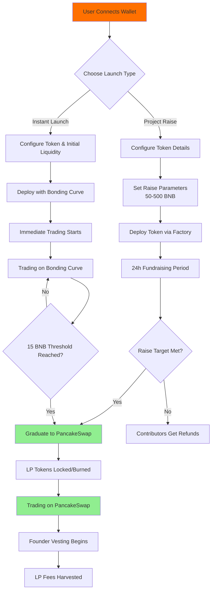
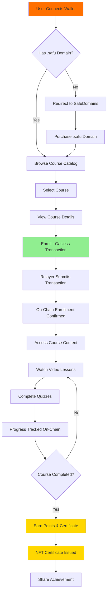
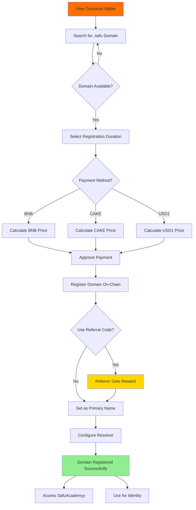
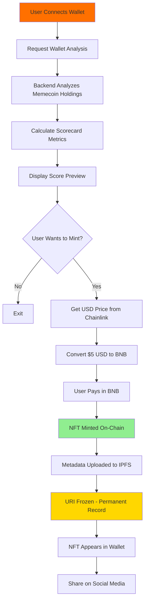
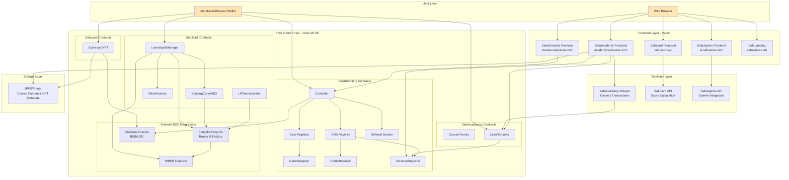
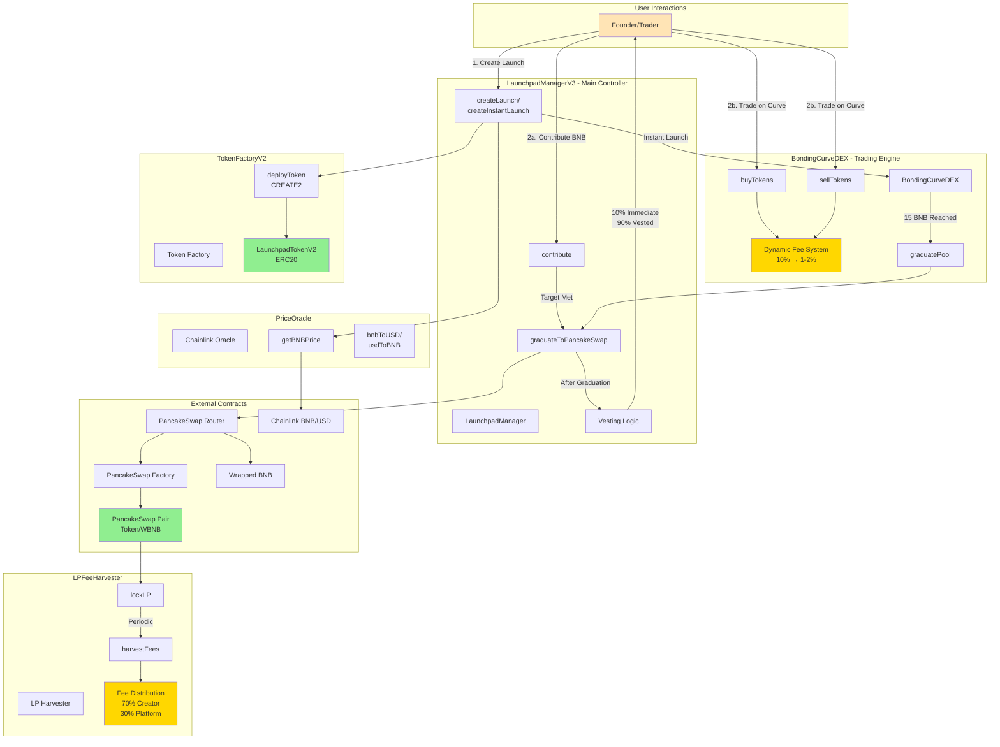
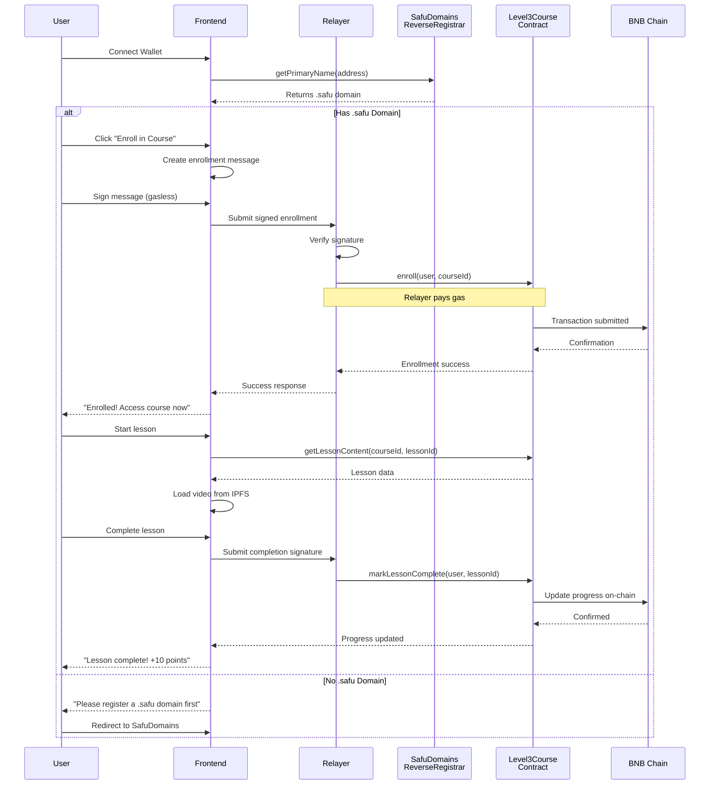

# Safuverse Ecosystem

[](https://opensource.org/licenses/MIT)

A comprehensive Web3 ecosystem **deployed on BNB Chain** (BNB Smart Chain - BSC), offering decentralized education, naming services, token launchpad, NFT scorecards, and AI-powered agents.

## Deployment Information

**Primary Network**: BNB Smart Chain (BSC)

- **BSC Mainnet** (Chain ID: 56)
- **BSC Testnet** (Chain ID: 97)

All smart contracts in this ecosystem are deployed and operational on BNB Chain, leveraging its low transaction costs and high throughput for optimal user experience.

## Ecosystem Components

### 1. SafuAcademy - Decentralized Education Platform

On-chain educational platform with gasless transactions, allowing domain owners to create and participate in blockchain courses.

**Live on BNB Chain**: https://academy.safuverse.com

**Features**:

- Gasless on-chain courses via a backend relayer
- Domain-gated access control
- Progress tracking stored on BSC
- Integration with SafuDomains naming service

**Directory**: `SafuAcademy/`

### 2. SafuDomains - Decentralized Naming Service

ENS-inspired domain name system with custom .safu TLD deployed on BNB Chain.

**Live on BNB Chain**: https://names.safuverse.com

**Features**:

- Custom .safu TLD on BSC
- Multi-token pricing (BNB, CAKE, USD1)
- Built-in referral rewards system
- Complete ENS registry implementation
- Chainlink price oracles for BNB/USD

**Directory**: `SafuDomains/`

### 3. SafuPad - Token Launchpad (In Development)

Fair launch platform with bonding curve mechanics and automatic PancakeSwap integration on BNB Chain.

**Features**:

- Two launch modes: Project Raise & Instant Launch
- Bonding curve DEX with dynamic fees
- Automatic graduation to PancakeSwap V2
- Anti-bot protection mechanisms
- BNB-denominated token launches (50-500 BNB)

**Directory**: `SafuPad/`

### 4. SafuPadSDK - TypeScript SDK

Comprehensive TypeScript SDK for interacting with SafuPad launchpad on BNB Chain.

**Features**:

- Full type safety with TypeScript
- Multi-network support (BSC Mainnet, BSC Testnet, localhost)
- Event handling and volume tracking
- Browser and Node.js compatible

**Directory**: `SafuPadSDK/`

### 5. Safucard - NFT Scorecard System

Dynamic NFT scorecard system with USD-pegged minting deployed on BNB Chain.

**Features**:

- ERC721 NFT with $5 USD dynamic pricing via Chainlink oracle
- Wallet memecoin score analysis
- Backend API for score calculation
- URI freezing after mint

**Directory**: `Safucard/`

- `SafucardNFT/` - Smart contracts
- `Safucardserver/` - Backend API
- `frontend/` - User interface

### 6. SafuAgents - AI Agents Interface

React-based frontend for interacting with AI agents, with Web3 wallet integration.

**Features**:

- Multi-chain wallet support (primary: BNB Chain)
- RainbowKit integration
- OpenAI-powered agents

**Directory**: `SafuAgents/`

### 7. SafuLanding - Marketing Website

Landing page and marketing website for the Safuverse ecosystem.

**Directory**: `SafuLanding/`

## User Journey Diagrams

### SafuPad - Token Launch Journey



### SafuAcademy - Learning Journey



### SafuDomains - Domain Registration Journey



### Safucard - NFT Scorecard Journey



## System Architecture

### Overall Ecosystem Architecture



### SafuPad Smart Contract Architecture



### Data Flow - SafuAcademy Gasless Enrollment



## Technology Stack

### Blockchain Infrastructure

- **Primary Network**: BNB Smart Chain (BSC Mainnet & Testnet)
- **Smart Contracts**: Solidity 0.8.17 - 0.8.28
- **Development**: Hardhat 2.x & 3.0
- **Standards**: ERC20, ERC721, ERC1155, EIP-2771

### BNB Chain Integrations

- **PancakeSwap V2/V3**: Automated liquidity provision and token trading
- **WBNB**: Wrapped BNB token integration
- **Chainlink on BSC**: Price oracles for BNB/USD and dynamic pricing
- **BSCScan**: Contract verification and transparency

### Frontend

- **Framework**: React 18-19, TypeScript
- **Build Tool**: Vite
- **Web3**: wagmi, viem (configured for BSC)
- **Wallet**: RainbowKit, MetaMask
- **UI**: Radix UI, Tailwind CSS

### Backend

- **Runtime**: Node.js with TypeScript
- **Relayer**: OpenZeppelin Defender (gasless transactions)
- **APIs**: Express-based REST APIs

## Repository Structure

```
Safuverse/
├── SafuAgents/          # AI agents interface
├── SafuAcademy/          # Educational platform contracts & frontend
├── SafuLanding/         # Marketing website
├── Safucard/            # NFT scorecard system
│   ├── SafucardNFT/     # Smart contracts
│   ├── Safucardserver/  # Backend API
│   └── frontend/        # User interface
├── SafuDomains/         # DNS naming service
├── SafuPad/   # Token launchpad contracts
└── SafuPadSDK/          # TypeScript SDK for launchpad
```

## Getting Started

Each sub-project contains its own README with detailed setup instructions. General steps:

### Prerequisites

- Node.js 18+ or Bun
- BNB Chain wallet (MetaMask recommended)
- BSC testnet BNB for development (get from https://testnet.bnbchain.org/faucet-smart)

### Environment Setup

Most projects require these environment variables:

```bash
# Blockchain Configuration
DEPLOYER_KEY=your_private_key_here
BSC_RPC_URL=https://bsc-dataseed.binance.org/
BSC_TESTNET_RPC_URL=https://data-seed-prebsc-1-s1.binance.org:8545/

# BSCScan Verification
BSCSCAN_API_KEY=your_bscscan_api_key
```

### Network Configuration

All projects are configured to deploy to:

- **BSC Mainnet**: Chain ID 56
- **BSC Testnet**: Chain ID 97

RPC endpoints are configured in each project's `hardhat.config.ts` or frontend configuration files.

## Smart Contract Deployments

All smart contracts are deployed and verified on BSCScan. Below are the deployed contract addresses for each component:

### SafuAcademy - Education Platform

**BSC Mainnet (Chain ID: 56)**:

- **Course Factory**: `0xE796bc81c3F372237641998c24C755e710832bA9`
- **Level3Course**: `0xD0cB04cB20Dff62E26b7069B95Fa9fF3D4694d13`

### SafuDomains - Naming Service

**BSC Mainnet (Chain ID: 56)**:

- **Controller**: `0x48511b6c15fe1F89bAf6b30dBFA35bF0eAaEB751`
- **Registry**: `0x6aEFc7ac590096c08187a9052030dA59dEd7E996`
- **ReverseRegistrar**: `0xc070aAcE207ad5eb2A460D059785ffC9D4D2C536`
- **BaseRegistrar**: `0xc85f95FCe09b582D546606f591CEEC88D88714f5`
- **NameWrapper**: `0x86a930d1931C11e3Ec46b3A050E27F29bF94B612`
- **PublicResolver**: `0xcAa73Cd19614523F9F3cfCa4A447120ceA8fd357`
- **Referral**: `0x182690bD985ef02Ae44A6F8a2e71666bDe1196E2`

### SafuPad - Token Launchpad (In Development)

**BSC Testnet (Chain ID: 97) - Unverified**:

- **LaunchpadManager**: `0x4c797EbaA64Cc7f1bD2a82A36bEE5Cf335D1830c`
- **BondingCurveDEX**: `0x14eB3B6C297ff6fefc25c0E0d289Bf8348e864f6`
- **TokenFactory**: `0xcb7526b9598240A737237C52f852705e6A449cD0`
- **PriceOracle**: `0x56f0b1f80F8cc37f875Be42e2f4D09810514F346`
- **LPFeeHarvester**: `0xa886B8897814193f99A88701d70b31b4a8E27a1E`

### Safucard - NFT Scorecard

**BSC Mainnet (Chain ID: 56)**:

- **ScorecardNFT**: Deployed with Chainlink oracle integration
- Dynamic USD-pegged pricing ($5 USD per mint)

## Development

### Install Dependencies

Each sub-project uses npm/yarn/bun:

```bash
cd <project-directory>
npm install
```

### Testing

Smart contract projects include Hardhat tests:

```bash
npx hardhat test
```

### Deployment to BSC

```bash
# Deploy to BSC Testnet
npx hardhat run scripts/deploy.ts --network bscTestnet

# Deploy to BSC Mainnet
npx hardhat run scripts/deploy.ts --network bsc
```

### Contract Verification on BSCScan

```bash
npx hardhat verify --network bsc <CONTRACT_ADDRESS> <CONSTRUCTOR_ARGS>
```

## BNB Chain Specific Features

This ecosystem leverages BNB Chain's unique advantages:

1. **Low Transaction Costs**: Enables gasless course enrollment via relayers
2. **High Throughput**: Supports high-frequency trading on bonding curves
3. **PancakeSwap Integration**: Native DEX integration for token graduation
4. **Chainlink Oracles**: Reliable BNB/USD price feeds for dynamic pricing
5. **BSC Ecosystem**: Integration with CAKE token and other BSC-native assets

## Live Deployments on BNB Chain

- **SafuAcademy**: https://academy.safuverse.com
- **SafuDomains**: https://names.safuverse.com
- **Safucard**: https://safucard.xyz
- **SafuAgents**: https://ai.safuverse.com

## Open-Source Dependencies

This section provides a comprehensive overview of all major open-source dependencies used across the Safuverse ecosystem, organized by category.

### Smart Contract Development

| Dependency | Version | License | Purpose | Used In |
|------------|---------|---------|---------|---------|
| **Solidity** | 0.8.17 - 0.8.28 | GPL-3.0 | Smart contract language | All contracts |
| **Hardhat** | 2.x - 3.0.7 | MIT | Development framework | All contract projects |
| **OpenZeppelin Contracts** | 5.3.0 - 5.4.0 | MIT | Secure contract libraries | All contracts |
| **@nomicfoundation/hardhat-toolbox** | 5.x | MIT | Hardhat plugin suite | SafuPad, SafuAcademyy |
| **@nomicfoundation/hardhat-chai-matchers** | 2.x | MIT | Testing matchers | All contract projects |
| **Chai** | 4.x | MIT | Assertion library | All contract tests |
| **Mocha** | 10.x | MIT | Test framework | All contract tests |
| **ethers** | 6.x | MIT | Ethereum library | All contract projects |
| **Typechain** | 8.x | MIT | TypeScript bindings | SafuPad |
| **hardhat-gas-reporter** | 1.x | MIT | Gas usage reporting | SafuPad |
| **solidity-coverage** | 0.8.x | MIT | Code coverage | SafuPad |

### Frontend Framework & Build Tools

| Dependency | Version | License | Purpose | Used In |
|------------|---------|---------|---------|---------|
| **React** | 18.2.0 - 19.x | MIT | UI framework | All frontends |
| **TypeScript** | 5.2.2 - 5.x | Apache-2.0 | Type safety | All frontends |
| **Vite** | 5.2.11 - 5.x | MIT | Build tool | SafuAcademyy, SafuAgents |
| **React Router DOM** | 6.16.0 | MIT | Client-side routing | SafuAcademyy |
| **Next.js** | 14.x | MIT | React framework | SafuDomains (possible) |

### Web3 & Blockchain Integration

| Dependency | Version | License | Purpose | Used In |
|------------|---------|---------|---------|---------|
| **Wagmi** | 2.15.6 | MIT | React hooks for Ethereum | All frontends |
| **Viem** | 2.29.0 | MIT | TypeScript Ethereum library | All frontends |
| **RainbowKit** | 2.2.8 | MIT | Wallet connection UI | SafuAcademyy, SafuAgents |
| **ethers (v5)** | 5.8.0 | MIT | Ethereum utilities | Frontends (legacy) |
| **@binance/w3w-wagmi-connector** | Latest | MIT | Binance Wallet connector | SafuAcademyy |
| **@metamask/sdk-react** | Latest | MIT | MetaMask integration | Various |

### UI Components & Styling

| Dependency | Version | License | Purpose | Used In |
|------------|---------|---------|---------|---------|
| **Tailwind CSS** | 3.3.3 - 3.x | MIT | Utility-first CSS | All frontends |
| **Radix UI** | 1.x | MIT | Accessible UI primitives | SafuAcademyy |
| **shadcn/ui** | Latest | MIT | Component collection | SafuAcademyy |
| **Framer Motion** | 10.16.4 | MIT | Animation library | SafuAcademyy |
| **Lucide React** | Latest | ISC | Icon library | SafuAcademyy |
| **PostCSS** | 8.x | MIT | CSS transformation | All frontends |
| **Autoprefixer** | 10.x | MIT | CSS vendor prefixes | All frontends |

### State Management & Data Fetching

| Dependency | Version | License | Purpose | Used In |
|------------|---------|---------|---------|---------|
| **TanStack Query (React Query)** | 5.82.0 | MIT | Server state management | SafuAcademyy |
| **Zustand** | 4.x | MIT | Client state management | Various |
| **SWR** | 2.x | MIT | Data fetching | SafuDomains (possible) |

### Media & Content

| Dependency | Version | License | Purpose | Used In |
|------------|---------|---------|---------|---------|
| **Video.js** | 7.21 | Apache-2.0 | Video player | SafuAcademyy |
| **Pinata SDK** | 2.4.9 | MIT | IPFS integration | SafuAcademyy, Safucard |

### Backend & API

| Dependency | Version | License | Purpose | Used In |
|------------|---------|---------|---------|---------|
| **Node.js** | 18+ | MIT | Runtime environment | All backends |
| **Express** | 4.x | MIT | Web framework | Safucard API |
| **OpenZeppelin Defender** | Latest | MIT | Transaction relayer | SafuAcademyy |

### BNB Chain Specific Integrations

| Dependency | Type | Purpose | Used In |
|------------|------|---------|---------|
| **PancakeSwap V2 Router** | Contract | DEX integration | SafuPad |
| **PancakeSwap V2 Factory** | Contract | Pair creation | SafuPad |
| **Chainlink BNB/USD Oracle** | Contract | Price feeds | SafuPad, SafuDomains, Safucard |
| **WBNB** | Contract | Wrapped BNB | SafuPad |

### Development & Testing

| Dependency | Version | License | Purpose | Used In |
|------------|---------|---------|---------|---------|
| **ESLint** | 8.x | MIT | Code linting | All projects |
| **Prettier** | 3.x | MIT | Code formatting | All projects |
| **ts-node** | 10.x | MIT | TypeScript execution | Contract projects |
| **chai-as-promised** | 7.x | WTFPL | Async test assertions | SafuPad |

### SafuPad SDK Specific

| Dependency | Version | License | Purpose |
|------------|---------|---------|---------|
| **ethers** | 6.x | MIT | Core Ethereum library |
| **@ethersproject/*** | 5.x | MIT | Ethereum utilities |
| **TypeScript** | 5.x | Apache-2.0 | Type definitions |

### License Summary

The Safuverse ecosystem primarily uses **MIT-licensed** dependencies, ensuring maximum compatibility and freedom for both development and deployment. Key licenses include:

- **MIT License**: ~90% of dependencies (permissive, allows commercial use)
- **Apache-2.0**: TypeScript, Video.js (permissive with patent grant)
- **GPL-3.0**: Solidity compiler (copyleft, contracts are MIT)
- **ISC**: Lucide icons (permissive, similar to MIT)

All dependencies are compatible with the MIT license used by Safuverse projects.

### Dependency Management

**Package Managers:**
- **npm** - Primary package manager for most projects
- **yarn** - Alternative package manager (supported)
- **bun** - Fast alternative (some projects)

**Version Control:**
- Lock files (`package-lock.json`, `yarn.lock`) committed to repository
- Semantic versioning followed for dependencies
- Regular updates via Dependabot (recommended)

**Security:**
- Dependencies audited regularly with `npm audit`
- OpenZeppelin contracts used for security-critical code
- Chainlink oracles for reliable price data
- No known critical vulnerabilities in production

### External Services & APIs

| Service | Purpose | Used In | Website |
|---------|---------|---------|---------|
| **BSCScan API** | Contract verification | All contracts | https://bscscan.com |
| **Chainlink** | Price oracles | SafuPad, Safucard, SafuDomains | https://chain.link |
| **PancakeSwap** | DEX integration | SafuPad | https://pancakeswap.finance |
| **Pinata** | IPFS hosting | SafuAcademyy, Safucard | https://pinata.cloud |
| **OpenAI API** | AI agents | SafuAgents | https://openai.com |
| **Vercel** | Frontend hosting | All frontends | https://vercel.com |
| **BNB Chain RPC** | Blockchain access | All projects | https://bscscan.com |

### Installation Instructions

To install all dependencies for a specific project:

```bash
# Navigate to project directory
cd <project-directory>

# Install dependencies
npm install

# Or with yarn
yarn install

# Or with bun
bun install
```

For the entire monorepo (all projects):

```bash
# Install all dependencies (from root)
for dir in SafuPad SafuAcademy SafuDomains Safucard SafuAgents SafuLanding safupadsdk; do
  (cd "$dir" && npm install)
done
```

### Updating Dependencies

```bash
# Check for outdated packages
npm outdated

# Update to latest within semver range
npm update

# Update to latest (potentially breaking)
npm install <package>@latest

# Security audit
npm audit
npm audit fix
```

## Contributing

We welcome contributions from the community! Whether you're fixing bugs, adding features, improving documentation, or writing tests, your help is appreciated.

**Quick Start:**

1. Fork the repository
2. Create a feature branch (`git checkout -b feature/amazing-feature`)
3. Make your changes and test thoroughly
4. Commit using conventional commits (`git commit -m 'feat: add amazing feature'`)
5. Push to your branch (`git push origin feature/amazing-feature`)
6. Open a Pull Request

For detailed guidelines, please read our [CONTRIBUTING.md](CONTRIBUTING.md).

## License

This project is licensed under the MIT License - see the [LICENSE](LICENSE) file for details.

Individual projects also contain their own LICENSE files:

- [SafuPad/LICENSE](SafuPad/LICENSE)
- [SafuAcademy/LICENSE](SafuAcademy/LICENSE)
- [SafuDomains/LICENSE.txt](SafuDomains/LICENSE.txt)
- [Safucard/SafucardNFT/LICENSE](Safucard/SafucardNFT/LICENSE)
- [SafuAgents/LICENSE](SafuAgents/LICENSE)
- [SafuLanding/LICENSE](SafuLanding/LICENSE)
- [SafuPadSDK/LICENSE](SafuPadSDK/LICENSE)

## Security

Smart contracts deployed on BNB Chain have been developed with security best practices:

- OpenZeppelin contract libraries
- Reentrancy guards
- Access control mechanisms
- Price oracle integration for fair pricing

For security concerns, please review individual project documentation.

## Support & Documentation

For detailed documentation on each component:

- Navigate to individual project directories
- Check project-specific README files
- Review smart contract comments and NatSpec documentation

## Network Information

### BSC Mainnet

- Chain ID: 56
- RPC: https://bsc-dataseed.binance.org/
- Explorer: https://bscscan.com
- Native Token: BNB

### BSC Testnet

- Chain ID: 97
- RPC: https://data-seed-prebsc-1-s1.binance.org:8545/
- Explorer: https://testnet.bscscan.com
- Faucet: https://testnet.bnbchain.org/faucet-smart

## Docker Deployment

The entire Safuverse ecosystem is fully dockerized for easy deployment and development. You can run all services with a single command using Docker Compose.

### Prerequisites

- Docker Engine 20.10+ installed
- Docker Compose v2.0+ installed
- At least 4GB RAM available for Docker
- 10GB free disk space

### Quick Start with Docker

1. **Clone the repository**:
```bash
git clone https://github.com/Level3AI-hub/Safuverse.git
cd Safuverse
```

2. **Set up environment variables**:

Create `.env` files for services that require them:

```bash
# SafuAgents Server
cp SafuAgents/server/.env.example SafuAgents/server/.env
# Edit SafuAgents/server/.env with your API keys

# Safucard Server
cp Safucard/Safucardserver/.env.example Safucard/Safucardserver/.env
# Edit Safucard/Safucardserver/.env with your configuration
```

3. **Build and run all services**:
```bash
docker-compose up --build
```

Or run in detached mode:
```bash
docker-compose up -d --build
```

4. **Access the services**:

Once all containers are running, you can access:

- **SafuAcademy Frontend**: http://localhost:3001
- **SafuAgents Frontend**: http://localhost:3002
- **SafuAgents Server API**: http://localhost:3003
- **SafuLanding**: http://localhost:3004
- **Safucard Frontend**: http://localhost:3005
- **Safucard Server API**: http://localhost:3006
- **SafuDomains Frontend**: http://localhost:3007
- **MongoDB**: localhost:27017 (credentials in docker-compose.yml)
- **Redis**: localhost:6379

### Docker Services Architecture

```
┌─────────────────────────────────────────────────────────┐
│                    Docker Network                        │
│                  (safuverse-network)                     │
├─────────────────────────────────────────────────────────┤
│                                                           │
│  ┌──────────────────┐  ┌──────────────────┐            │
│  │ SafuAcademy      │  │ SafuAgents       │            │
│  │ Frontend :3001   │  │ Frontend :3002   │            │
│  └──────────────────┘  └──────────────────┘            │
│                                                           │
│  ┌──────────────────┐  ┌──────────────────┐            │
│  │ SafuAgents       │  │ SafuLanding      │            │
│  │ Server :3003     │  │ :3004            │            │
│  └──────────────────┘  └──────────────────┘            │
│                                                           │
│  ┌──────────────────┐  ┌──────────────────┐            │
│  │ Safucard         │  │ Safucard         │            │
│  │ Frontend :3005   │  │ Server :3006     │            │
│  └──────────────────┘  └────────┬─────────┘            │
│                                  │                        │
│  ┌──────────────────┐           │                        │
│  │ SafuDomains      │           │                        │
│  │ Frontend :3007   │           │                        │
│  └──────────────────┘           │                        │
│                                  │                        │
│                    ┌─────────────┴──────────┐           │
│                    │                         │           │
│              ┌─────▼─────┐           ┌──────▼────┐      │
│              │ MongoDB    │           │  Redis    │      │
│              │ :27017     │           │  :6379    │      │
│              └────────────┘           └───────────┘      │
│                                                           │
└─────────────────────────────────────────────────────────┘
```

### Docker Commands Reference

**Start all services**:
```bash
docker-compose up -d
```

**Stop all services**:
```bash
docker-compose down
```

**Stop and remove volumes** (⚠️ This will delete database data):
```bash
docker-compose down -v
```

**View logs**:
```bash
# All services
docker-compose logs -f

# Specific service
docker-compose logs -f safuagents-server
docker-compose logs -f safucard-server
```

**Rebuild a specific service**:
```bash
docker-compose up -d --build safuagents-frontend
```

**Check service status**:
```bash
docker-compose ps
```

**Execute commands in a container**:
```bash
# Access MongoDB shell
docker-compose exec mongodb mongosh -u admin -p safuverse2024

# Access Redis CLI
docker-compose exec redis redis-cli

# Access a service shell
docker-compose exec safucard-server sh
```

### Individual Service Dockerfiles

Each service has its own Dockerfile optimized for production:

- `SafuAcademy/frontend/Dockerfile` - Multi-stage build with Nginx
- `SafuAgents/frontend/Dockerfile` - Multi-stage build with Nginx
- `SafuAgents/server/Dockerfile` - Node.js server
- `SafuLanding/Dockerfile` - Multi-stage build with Nginx
- `Safucard/frontend/Dockerfile` - Multi-stage build with Nginx
- `Safucard/Safucardserver/Dockerfile` - TypeScript compiled Node.js server
- `safudomains/frontend/Dockerfile` - Multi-stage build with Nginx

You can build and run individual services:

```bash
# Build individual service
cd SafuAcademy/frontend
docker build -t safuacademy-frontend .

# Run individual service
docker run -p 3001:80 safuacademy-frontend
```

### Production Deployment

For production deployment, consider:

1. **Environment Variables**: Use proper secret management (e.g., Docker Secrets, AWS Secrets Manager)
2. **Reverse Proxy**: Use Nginx or Traefik as a reverse proxy
3. **HTTPS**: Configure SSL/TLS certificates (Let's Encrypt recommended)
4. **Resource Limits**: Set CPU and memory limits in docker-compose.yml
5. **Health Checks**: Add health check endpoints and Docker health checks
6. **Logging**: Configure proper log aggregation (ELK stack, CloudWatch, etc.)
7. **Monitoring**: Set up Prometheus + Grafana for monitoring
8. **Backups**: Regular backups of MongoDB and Redis data volumes

Example production configuration additions:

```yaml
services:
  safucard-server:
    # ... existing config
    deploy:
      resources:
        limits:
          cpus: '1'
          memory: 1G
        reservations:
          cpus: '0.5'
          memory: 512M
    healthcheck:
      test: ["CMD", "wget", "--spider", "-q", "http://localhost:3000/health"]
      interval: 30s
      timeout: 10s
      retries: 3
      start_period: 40s
```

### Troubleshooting

**Port conflicts**:
If ports are already in use, edit `docker-compose.yml` and change the port mappings:
```yaml
ports:
  - "8001:80"  # Change 3001 to 8001
```

**Build failures**:
```bash
# Clean Docker cache and rebuild
docker-compose build --no-cache
docker system prune -a
```

**Container won't start**:
```bash
# Check logs for errors
docker-compose logs <service-name>

# Inspect container
docker inspect <container-name>
```

**Database connection issues**:
- Ensure MongoDB and Redis are fully started before dependent services
- Check network connectivity: `docker-compose exec safucard-server ping mongodb`
- Verify environment variables are correctly set

### Development vs Production

**Development**:
- Use `docker-compose up` to see logs in real-time
- Mount volumes for hot-reloading (add to docker-compose.yml):
  ```yaml
  volumes:
    - ./SafuAgents/server:/app
    - /app/node_modules
  ```

**Production**:
- Use `docker-compose up -d` for detached mode
- Implement proper monitoring and logging
- Use production-grade databases (managed services recommended)
- Enable Docker restart policies

---

**Built on BNB Chain** - Leveraging the power of BNB Smart Chain for scalable, efficient Web3 applications.
