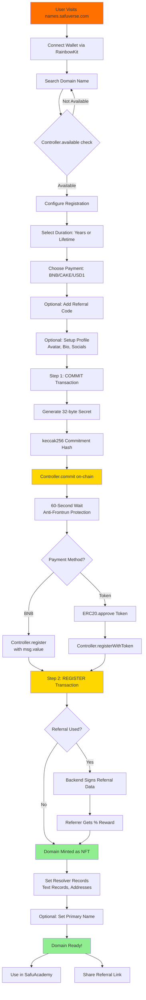
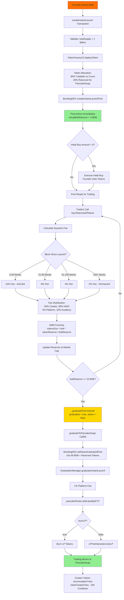
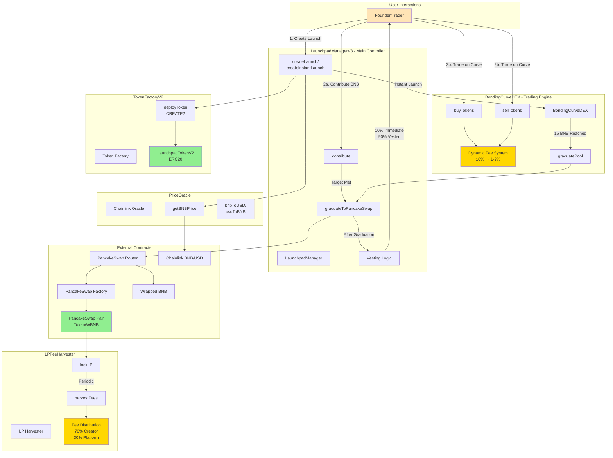
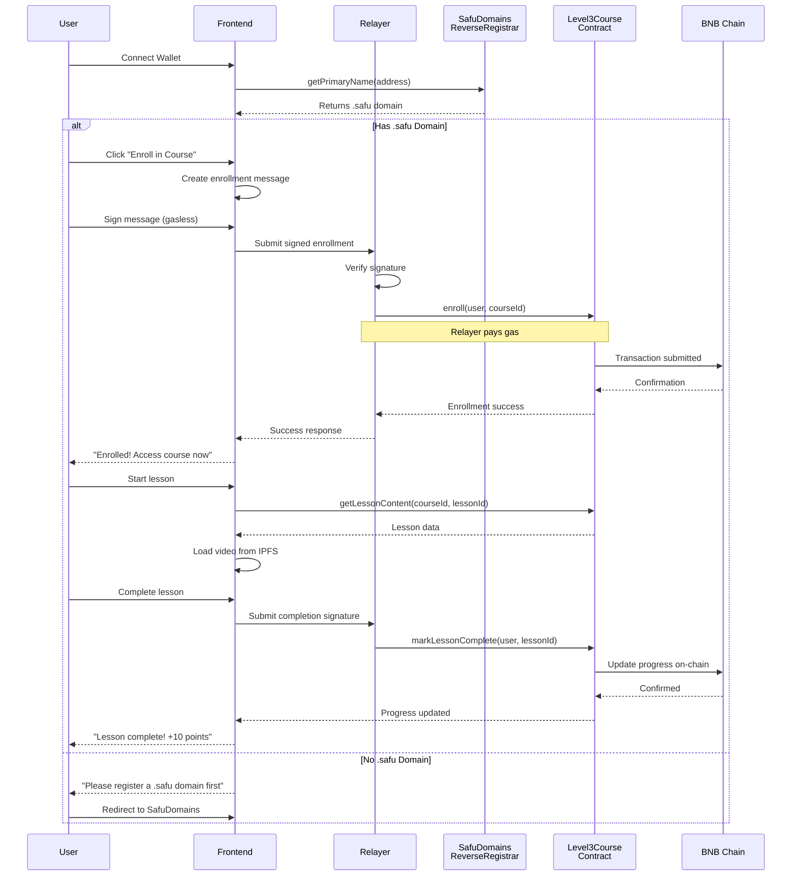

# Safuverse Ecosystem

[](https://opensource.org/licenses/MIT)

A comprehensive Web3 ecosystem **deployed on BNB Chain** (BNB Smart Chain - BSC), offering decentralized education, naming services, token launchpad, NFT scorecards, and AI-powered agents.

## Deployment Information

**Primary Network**: BNB Smart Chain (BSC)

- **BSC Mainnet** (Chain ID: 56)
- **BSC Testnet** (Chain ID: 97)

All smart contracts in this ecosystem are deployed and operational on BNB Chain, leveraging its low transaction costs and high throughput for optimal user experience.

## Ecosystem Components

### 1. SafuAcademy - Decentralized Education Platform

On-chain educational platform with gasless transactions, allowing domain owners to create and participate in blockchain courses.

**Live on BNB Chain**: https://safuverse.vercel.app

**Features**:

- Gasless on-chain courses via a backend relayer
- Domain-gated access control
- Progress tracking stored on BSC
- Integration with SafuDomains naming service

**Directory**: `SafuAcademy/`

### 2. SafuDomains - Decentralized Naming Service

ENS-inspired domain name system with custom .safu TLD deployed on BNB Chain.

**Live on BNB Chain**: https://safudomains.vercel.app

**Features**:

- Custom .safu TLD on BSC
- Multi-token pricing (BNB, CAKE, USD1)
- Built-in referral rewards system
- Complete ENS registry implementation
- Chainlink price oracles for BNB/USD

**Directory**: `SafuDomains/`

### 3. SafuPad - Token Launchpad(https://safupad.xyz)

Fair launch platform with bonding curve mechanics and automatic PancakeSwap integration on BNB Chain.

**Features**:

- Two launch modes: Project Raise & Instant Launch
- Bonding curve DEX with dynamic fees
- Automatic graduation to PancakeSwap V2
- Anti-bot protection mechanisms
- BNB-denominated token launches (50-500 BNB)

**Directory**: `SafuPad/`

### 4. SafuPadSDK - TypeScript SDK

Comprehensive TypeScript SDK for interacting with SafuPad launchpad on BNB Chain.

**Features**:

- Full type safety with TypeScript
- Multi-network support (BSC Mainnet, BSC Testnet, localhost)
- Event handling and volume tracking
- Browser and Node.js compatible

**Directory**: `SafuPadSDK/`

### 5. Safucard - NFT Scorecard System

Dynamic NFT scorecard system with USD-pegged minting deployed on BNB Chain.

**Features**:

- ERC721 NFT with $5 USD dynamic pricing via Chainlink oracle
- Wallet memecoin score analysis
- Backend API for score calculation
- URI freezing after mint

**Directory**: `Safucard/`

- `SafucardNFT/` - Smart contracts
- `Safucardserver/` - Backend API
- `frontend/` - User interface

### 6. SafuAgents - AI Agents Interface

React-based frontend for interacting with AI agents, with Web3 wallet integration.

**Features**:

- Multi-chain wallet support (primary: BNB Chain)
- RainbowKit integration
- OpenAI-powered agents

**Directory**: `SafuAgents/`

### 7. SafuLanding - Marketing Website

Landing page and marketing website for the Safuverse ecosystem.

**Directory**: `SafuLanding/`

## User Journey Diagrams (From Code Implementation)

### SafuDomains - Domain Registration Flow

Based on the actual frontend implementation (`components/register.tsx`, `hooks/useRegistration.ts`):



**Key Contracts Used:**
- Controller: `0xC902396A4E49914d1266cc80e22Aa182dcF23138`
- NameWrapper: `0xbf4B53F867dfE5A78Cf268AfBfC1f334044e61ae`
- PublicResolver: `0x50143d9f7e496fF58049dE0db6FaDfB43FfE18e7`
- Referral: `0x92149696fDDC858A76253F71268D34147e662410`

---

### SafuAcademy - Course Enrollment & Learning Flow

Based on actual implementation (`lib/services/course.service.ts`, `lib/services/relayer.service.ts`, `lib/services/progress.service.ts`):

```mermaid
graph TD
    A[User Visits academy.safuverse.com] --> B[Connect Wallet via RainbowKit]
    B --> C[Sign Message for JWT Auth]
    C --> D[API: /api/user/domain-status]

    D --> E{Check ENS ReverseRegistrar<br/>for .safu domain}
    E -->|No Domain| F[Modal: Register .safu Domain]
    F --> G[Redirect to names.safuverse.com]
    G --> E

    E -->|Has Domain| H[Browse Course Catalog]
    H --> I[Select Course]
    I --> J[View: Lessons, Duration, Points]

    J --> K{Course Type?}
    K -->|BEGINNER| L[Free Enrollment]
    K -->|PREMIUM| M[Check Points Balance]
    K -->|ADVANCED| N[Check minPointsToAccess]

    M --> O{Enough Points?}
    O -->|No| P[Earn More Points First]
    O -->|Yes| L

    N --> Q{Meets Requirement?}
    Q -->|No| P
    Q -->|Yes| L

    L --> R[Click Enroll Button]
    R --> S[POST /api/courses/id/enroll]

    S --> T[Database Transaction:<br/>Deduct Points, Create UserCourse]
    T --> U[RelayerService.enrollUser]
    U --> V[Relayer Wallet Signs TX]
    V --> W[Level3Course.enroll on-chain<br/>Relayer Pays Gas]

    W --> X[Enrollment Complete!]
    X --> Y[Access Video Lessons]

    Y --> Z[VideoPlayer Component<br/>Track Watch Progress]
    Z --> AA{Watched >= 50%?}
    AA -->|No| Z
    AA -->|Yes| AB[POST /api/lessons/id/complete]

    AB --> AC[Mark Lesson Watched<br/>Award watchPoints]
    AC --> AD{Has Quiz?}
    AD -->|No| AE[Lesson 100% Complete]
    AD -->|Yes| AF[Unlock Quiz Button]

    AF --> AG[Take Quiz]
    AG --> AH{Score >= passingScore?}
    AH -->|No| AG
    AH -->|Yes| AI[Award quizPoints<br/>Lesson 100% Complete]

    AE --> AJ[Recalculate Course Progress]
    AI --> AJ

    AJ --> AK{Progress = 100%?}
    AK -->|No| Y
    AK -->|Yes| AL[Award completionPoints]

    AL --> AM[RelayerService.completeCourse]
    AM --> AN[Level3Course.completeCourse on-chain]
    AN --> AO[Certificate Ready!]

    style A fill:#FF7000
    style W fill:#FFD700
    style X fill:#90EE90
    style AN fill:#FFD700
    style AO fill:#90EE90
```



**Key Implementation Details:**
- **Gasless Enrollment**: Relayer wallet pays gas, user signs nothing for enrollment
- **Two-Phase Sync**: Database first (instant), blockchain async (background)
- **Progress Formula**: `(watchedLessons + passedQuizzes) / (totalLessons + quizzableLessons) * 100`
- **Contract**: Level3Course at `0x1988Bc593015Fe29ED7562Ba672a8798b3B13e88`

---

### SafuPad - Project Raise Flow

Based on actual contract implementation (`LaunchpadManagerV3.sol`, `ContributionManager.sol`, `VestingManager.sol`):

```mermaid
graph TD
    A[Founder Connects Wallet] --> B[createLaunch Transaction]

    B --> C[TokenFactoryV2.deployToken<br/>ERC20 with Transfer Lock]
    C --> D[Token Allocation:<br/>20% Founder, 20% Contributors<br/>10% Vesting, 10% Liquidity, 40% PancakeSwap]

    D --> E[Set raiseTarget & raiseMax<br/>vestingDuration = 365 days FORCED]
    E --> F[Launch Active<br/>Contributions Open]

    F --> G[Contributors Call contribute]
    G --> H[ContributionManager Validates:<br/>Deadline, Per-Wallet Limit]
    H --> I[BNB Held in Contract<br/>contributions mapping updated]

    I --> J{totalRaised >= raiseTarget?}
    J -->|No, Deadline Passed| K[claimRefund Available<br/>Full BNB Returned]
    J -->|Yes| L[_completeRaise Internal]

    L --> M[raiseCompleted = true]
    M --> N[Calculate Allocations:<br/>20% Liquidity BNB<br/>20% Founder Immediate<br/>60% Vesting Pool]

    N --> O[Transfer 20% Tokens to Founder]
    O --> P[Transfer 20% BNB to Founder]
    P --> Q[vestingStartTime = now]

    Q --> R[Contributors Call claimContributorTokens]
    R --> S[tokens = contribution/totalRaised * 20% supply]

    S --> T[graduateToPancakeSwap Called]
    T --> U[GraduationManager.graduateProjectRaise]
    U --> V[1% Platform Fee Deducted]
    V --> W[pancakeRouter.addLiquidityETH<br/>Creates Token/WBNB Pair]

    W --> X{burnLP Setting?}
    X -->|true| Y[LP Tokens Sent to Burn Address]
    X -->|false| Z[LPFeeHarvester.lockLP<br/>365 Day Lock]

    Y --> AA[token.enableTransfers]
    Z --> AA

    AA --> AB[Trading Live on PancakeSwap!]

    AB --> AC[Founder Claims Vested BNB<br/>Monthly over 365 Days]
    AC --> AD[claimFounderTokens<br/>10% Vested Tokens Released]

    Z --> AE[Monthly Fee Harvesting<br/>70% Creator, 20% InfoFi, 10% Platform]

    style A fill:#FF7000
    style L fill:#FFD700
    style W fill:#FFD700
    style AB fill:#90EE90
```



---

### SafuPad - Instant Launch Flow

Based on actual contract implementation (`BondingDEX.sol`, `LaunchpadManagerV3.sol`):



**Key Mechanics:**
- **Virtual Reserve**: Shapes curve to reach 6x price multiplier at graduation
- **Graduation Threshold**: 15 BNB triggers automatic graduation
- **Fee Decay**: Anti-bot protection with 10% → 2% fee reduction over 100 blocks
- **Creator Fee Protection**: Self-trades redirect fees to InfoFi

### Safucard - NFT Scorecard Journey

Based on actual implementation (`Safucard.sol`, `App.tsx`, backend API):

```mermaid
graph TD
    A[User Visits safucard.xyz] --> B[Connect Wallet via RainbowKit]
    B --> C[Enter Wallet Address to Analyze]

    C --> D[POST /api/score<br/>Backend Wallet Analysis]
    D --> E[Analyze BSC Transactions<br/>Memecoin Holdings & Activity]

    E --> F[Calculate Score Metrics:<br/>- Total Trades<br/>- Win Rate<br/>- Profit/Loss<br/>- Token Diversity]
    F --> G[Display Scorecard Preview]

    G --> H{User Wants to Mint?}
    H -->|No| I[Exit or Share Preview]
    H -->|Yes| J[Safucard.getMintFeeInNative]

    J --> K[Chainlink Oracle Query<br/>0x0567F2323251f0Aab15c8dFb1967E4e8A7D42aeE]
    K --> L[Calculate $5 USD in BNB<br/>mintFee = 5 USD / latestPrice]

    L --> M[User Approves Transaction]
    M --> N[Safucard.mintNFT with _URI<br/>Contract: 0x7Eb73a8dE1cf916A8a6eCA6C7Da218d2a4A72e65]

    N --> O[Validate msg.value >= mintFee]
    O --> P[ERC721._safeMint to User]
    P --> Q[_tokenURIs[tokenId] = _URI]

    Q --> R[Upload Metadata to IPFS<br/>via Pinata API]
    R --> S[URI Frozen - Immutable Record]

    S --> T[NFT Appears in Wallet]
    T --> U[Share on Social Media]
    T --> V[View on BSCScan]

    style A fill:#FF7000
    style K fill:#E6E6FA
    style N fill:#FFD700
    style P fill:#90EE90
    style S fill:#90EE90
```

**Key Technical Details:**
- **Contract**: `0x7Eb73a8dE1cf916A8a6eCA6C7Da218d2a4A72e65`
- **Chainlink BNB/USD Oracle**: `0x0567F2323251f0Aab15c8dFb1967E4e8A7D42aeE`
- **Mint Price**: $5 USD (dynamically calculated in BNB)
- **Storage**: IPFS via Pinata for permanent metadata
- **URI Freezing**: Once minted, token URI cannot be changed

---

## System Architecture (From Code Implementation)

### Overall Ecosystem Architecture

```mermaid
graph TB
    subgraph "User Layer"
        U1[Web Browser]
        U2[RainbowKit Wallet Connection<br/>MetaMask, Binance, Coinbase, WalletConnect]
    end

    subgraph "Frontend Layer - Vercel/Next.js"
        F1[SafuAcademy Next.js App<br/>academy.safuverse.com<br/>Wagmi + TanStack Query]
        F2[SafuDomains React App<br/>names.safuverse.com<br/>Wagmi + Apollo GraphQL]
        F3[Safucard Frontend<br/>safucard.xyz]
        F4[SafuAgents Frontend<br/>ai.safuverse.com]
    end

    subgraph "Backend Services"
        B1[SafuAcademy API Routes<br/>Next.js /api/*<br/>Prisma + PostgreSQL]
        B2[Relayer Service<br/>ethers.js Wallet<br/>Pays Gas for Users]
        B3[Referral Signature API<br/>/api/referral/generate]
    end

    subgraph "BNB Smart Chain - Chain ID 56"
        subgraph "SafuPad Contracts (Modular)"
            SP1[LaunchpadManagerV3<br/>Facade Orchestrator]
            SP2[BondingCurveDEX<br/>AMM with Virtual Reserve]
            SP3[TokenFactoryV2<br/>CREATE2 Deployment]
            SP4[LPFeeHarvester<br/>365-Day LP Lock]
            SP5[ContributionManager]
            SP6[VestingManager]
            SP7[GraduationManager]
        end

        subgraph "SafuAcademy Contracts"
            SA1[Level3Course<br/>enroll, completeCourse]
            SA2[CourseFactory<br/>Course Deployment]
        end

        subgraph "SafuDomains Contracts (ENS-Based)"
            SD1[ENS Registry<br/>0xa886B8897814193f99A88701d70b31b4a8E27a1E]
            SD2[Controller<br/>commit/register Pattern<br/>0xC902396A4E49914d1266cc80e22Aa182dcF23138]
            SD3[BaseRegistrar<br/>0x4c797EbaA64Cc7f1bD2a82A36bEE5Cf335D1830c]
            SD4[NameWrapper<br/>0xbf4B53F867dfE5A78Cf268AfBfC1f334044e61ae]
            SD5[PublicResolver<br/>Text Records, Addresses<br/>0x50143d9f7e496fF58049dE0db6FaDfB43FfE18e7]
            SD6[ReverseRegistrar<br/>Primary Name Resolution<br/>0x1D0831eA9486Fada3887a737E8d6f8C6Ad72a125]
            SD7[Referral Contract<br/>Tier-Based Rewards<br/>0x92149696fDDC858A76253F71268D34147e662410]
        end

        subgraph "External BSC Integrations"
            EX1[PancakeSwap V2 Router<br/>0x10ED43C718714eb63d5aA57B78B54704E256024E]
            EX2[Chainlink BNB/USD<br/>0x0567F2323251f0Aab15c8dFb1967E4e8A7D42aeE]
            EX3[WBNB Contract]
            EX4[CAKE Token<br/>0x0E09FaBB73Bd3Ade0a17ECC321fD13a19e81cE82]
            EX5[USD1 Token<br/>0x8d0D000Ee44948FC98c9B98A4FA4921476f08B0d]
        end
    end

    subgraph "Data Layer"
        D1[PostgreSQL<br/>Users, Courses, Progress]
        D2[The Graph Subgraph<br/>Domain Queries]
        D3[IPFS/Pinata<br/>Video Content]
    end

    U1 --> F1
    U1 --> F2
    U2 --> F1
    U2 --> F2

    F1 --> B1
    B1 --> B2
    B2 --> SA1

    F2 --> B3
    F2 --> SD2

    B1 --> D1
    F2 --> D2
    F1 --> D3

    SP1 --> SP2
    SP1 --> SP3
    SP1 --> SP5
    SP1 --> SP6
    SP1 --> SP7
    SP7 --> EX1
    SP4 --> EX1

    SA1 --> SD6

    SD2 --> SD1
    SD2 --> SD3
    SD3 --> SD4
    SD2 --> SD5
    SD2 --> SD7
    SD2 --> EX2
    SD2 --> EX4
    SD2 --> EX5

    style U1 fill:#FFE4B5
    style U2 fill:#FFE4B5
    style B2 fill:#FFD700
    style EX1 fill:#E6E6FA
    style EX2 fill:#E6E6FA
```



### SafuPad Smart Contract Architecture



### Data Flow - SafuAcademy Gasless Enrollment



## Technology Stack

### Blockchain Infrastructure

- **Primary Network**: BNB Smart Chain (BSC Mainnet & Testnet)
- **Smart Contracts**: Solidity 0.8.17 - 0.8.28
- **Development**: Hardhat 2.x & 3.0
- **Standards**: ERC20, ERC721, ERC1155, EIP-2771

### BNB Chain Integrations

- **PancakeSwap V2/V3**: Automated liquidity provision and token trading
- **WBNB**: Wrapped BNB token integration
- **Chainlink on BSC**: Price oracles for BNB/USD and dynamic pricing
- **BSCScan**: Contract verification and transparency

### Frontend

- **Framework**: React 18-19, TypeScript
- **Build Tool**: Vite
- **Web3**: wagmi, viem (configured for BSC)
- **Wallet**: RainbowKit, MetaMask
- **UI**: Radix UI, Tailwind CSS

### Backend

- **Runtime**: Node.js with TypeScript
- **Relayer**: OpenZeppelin Defender (gasless transactions)
- **APIs**: Express-based REST APIs

## Repository Structure

```
Safuverse/
├── SafuAgents/          # AI agents interface
├── SafuAcademy/          # Educational platform contracts & frontend
├── SafuLanding/         # Marketing website
├── Safucard/            # NFT scorecard system
│   ├── SafucardNFT/     # Smart contracts
│   ├── Safucardserver/  # Backend API
│   └── frontend/        # User interface
├── SafuDomains/         # DNS naming service
├── SafuPad/   # Token launchpad contracts
└── SafuPadSDK/          # TypeScript SDK for launchpad
```

## Quick Start - Running Frontends

Run both SafuAcademy and SafuDomains frontends with a single command:

### Installation

```bash
# Clone the repository
git clone https://github.com/Level3AI-hub/Safuverse.git
cd Safuverse

# Install all dependencies (root + subprojects via postinstall)
npm install
```

The `postinstall` script automatically installs dependencies for both SafuAcademy and SafuDomains frontends.

### Running Both Frontends Together

```bash
# Start both frontends concurrently
npm run dev
```

This launches:
- **SafuAcademy**: http://localhost:5173
- **SafuDomains**: http://localhost:5174

### Individual Commands

```bash
# Run SafuAcademy frontend only
npm run dev:academy

# Run SafuDomains frontend only
npm run dev:domains

# Build all frontends
npm run build:all

# Build individual frontends
npm run build:academy
npm run build:domains

# Install all subproject dependencies manually
npm run install:all
```

## Getting Started (Detailed)

Each sub-project contains its own README with detailed setup instructions. General steps:

### Prerequisites

- Node.js 18+ or Bun
- BNB Chain wallet (MetaMask recommended)
- BSC testnet BNB for development (get from https://testnet.bnbchain.org/faucet-smart)

### Environment Setup

Most projects require these environment variables:

```bash
# Blockchain Configuration
DEPLOYER_KEY=your_private_key_here
BSC_RPC_URL=https://bsc-dataseed.binance.org/
BSC_TESTNET_RPC_URL=https://data-seed-prebsc-1-s1.binance.org:8545/

# BSCScan Verification
BSCSCAN_API_KEY=your_bscscan_api_key
```

### Network Configuration

All projects are configured to deploy to:

- **BSC Mainnet**: Chain ID 56
- **BSC Testnet**: Chain ID 97

RPC endpoints are configured in each project's `hardhat.config.ts` or frontend configuration files.

## Smart Contract Deployments

All smart contracts are deployed and verified on BSCScan. Below are the deployed contract addresses for each component (sourced from frontend code):

### SafuAcademy - Education Platform

**BSC Mainnet (Chain ID: 56)**:

- **Level3Course**: `0x1988Bc593015Fe29ED7562Ba672a8798b3B13e88`

### SafuDomains - Naming Service

**BSC Mainnet (Chain ID: 56)**:

- **Controller**: `0xC902396A4E49914d1266cc80e22Aa182dcF23138`
- **Registry**: `0xa886B8897814193f99A88701d70b31b4a8E27a1E`
- **ReverseRegistrar**: `0x1D0831eA9486Fada3887a737E8d6f8C6Ad72a125`
- **BaseRegistrar**: `0x4c797EbaA64Cc7f1bD2a82A36bEE5Cf335D1830c`
- **NameWrapper**: `0xbf4B53F867dfE5A78Cf268AfBfC1f334044e61ae`
- **BulkRenewal**: `0x2156C655d4668E7DB7584CA9B2a8Bc18A9125254`
- **PublicResolver**: `0x50143d9f7e496fF58049dE0db6FaDfB43FfE18e7`
- **Referral**: `0x92149696fDDC858A76253F71268D34147e662410`

### SafuPad - Token Launchpad

**BSC Mainnet (Chain ID: 56)**:

- **LaunchpadManager**: `0x93f526689Ddccd35882b7Ec3C79F40e70fe3014d`
- **BondingCurveDEX**: `0x4647a56f1B1624443fC084aE4A54208889495874`
- **TokenFactory**: `0xFd66bB7a03F911302f807d0CEFdEfb7eE88b385a`
- **PriceOracle**: `0x0f452bE1BE3cefE23Bfe2D1f1831b83073471699`
- **LPFeeHarvester**: `0xAd0edb8cf7Cd9BF8ca11Fc8A9593c15a922D8870`
- **PancakeSwap Router**: `0x10ED43C718714eb63d5aA57B78B54704E256024E`
- **PancakeSwap Factory**: `0xcA143Ce32Fe78f1f7019d7d551a6402fC5350c73`

### Safucard - NFT Scorecard

**BSC Mainnet (Chain ID: 56)**:

- **ScorecardNFT**: `0x7Eb73a8dE1cf916A8a6eCA6C7Da218d2a4A72e65`
- **Chainlink BNB/USD Oracle**: `0x0567F2323251f0Aab15c8dFb1967E4e8A7D42aeE`
- Dynamic USD-pegged pricing ($5 USD per mint)

## Development

### Install Dependencies

Each sub-project uses npm/yarn/bun:

```bash
cd <project-directory>
npm install
```

### Testing

Smart contract projects include Hardhat tests:

```bash
npx hardhat test
```

### Deployment to BSC

```bash
# Deploy to BSC Testnet
npx hardhat run scripts/deploy.ts --network bscTestnet

# Deploy to BSC Mainnet
npx hardhat run scripts/deploy.ts --network bsc
```

### Contract Verification on BSCScan

```bash
npx hardhat verify --network bsc <CONTRACT_ADDRESS> <CONSTRUCTOR_ARGS>
```

## BNB Chain Specific Features

This ecosystem leverages BNB Chain's unique advantages:

1. **Low Transaction Costs**: Enables gasless course enrollment via relayers
2. **High Throughput**: Supports high-frequency trading on bonding curves
3. **PancakeSwap Integration**: Native DEX integration for token graduation
4. **Chainlink Oracles**: Reliable BNB/USD price feeds for dynamic pricing
5. **BSC Ecosystem**: Integration with CAKE token and other BSC-native assets

## Live Deployments on BNB Chain

- **SafuAcademy**: https://academy.safuverse.com
- **SafuDomains**: https://names.safuverse.com
- **Safucard**: https://safucard.xyz
- **SafuAgents**: https://ai.safuverse.com

## Open-Source Dependencies

This section provides a comprehensive overview of all major open-source dependencies used across the Safuverse ecosystem, organized by category.

### Smart Contract Development

| Dependency | Version | License | Purpose | Used In |
|------------|---------|---------|---------|---------|
| **Solidity** | 0.8.17 - 0.8.28 | GPL-3.0 | Smart contract language | All contracts |
| **Hardhat** | 2.x - 3.0.7 | MIT | Development framework | All contract projects |
| **OpenZeppelin Contracts** | 5.3.0 - 5.4.0 | MIT | Secure contract libraries | All contracts |
| **@nomicfoundation/hardhat-toolbox** | 5.x | MIT | Hardhat plugin suite | SafuPad, SafuAcademyy |
| **@nomicfoundation/hardhat-chai-matchers** | 2.x | MIT | Testing matchers | All contract projects |
| **Chai** | 4.x | MIT | Assertion library | All contract tests |
| **Mocha** | 10.x | MIT | Test framework | All contract tests |
| **ethers** | 6.x | MIT | Ethereum library | All contract projects |
| **Typechain** | 8.x | MIT | TypeScript bindings | SafuPad |
| **hardhat-gas-reporter** | 1.x | MIT | Gas usage reporting | SafuPad |
| **solidity-coverage** | 0.8.x | MIT | Code coverage | SafuPad |

### Frontend Framework & Build Tools

| Dependency | Version | License | Purpose | Used In |
|------------|---------|---------|---------|---------|
| **React** | 18.2.0 - 19.x | MIT | UI framework | All frontends |
| **TypeScript** | 5.2.2 - 5.x | Apache-2.0 | Type safety | All frontends |
| **Vite** | 5.2.11 - 5.x | MIT | Build tool | SafuAcademyy, SafuAgents |
| **React Router DOM** | 6.16.0 | MIT | Client-side routing | SafuAcademyy |
| **Next.js** | 14.x | MIT | React framework | SafuDomains (possible) |

### Web3 & Blockchain Integration

| Dependency | Version | License | Purpose | Used In |
|------------|---------|---------|---------|---------|
| **Wagmi** | 2.15.6 | MIT | React hooks for Ethereum | All frontends |
| **Viem** | 2.29.0 | MIT | TypeScript Ethereum library | All frontends |
| **RainbowKit** | 2.2.8 | MIT | Wallet connection UI | SafuAcademyy, SafuAgents |
| **ethers (v5)** | 5.8.0 | MIT | Ethereum utilities | Frontends (legacy) |
| **@binance/w3w-wagmi-connector** | Latest | MIT | Binance Wallet connector | SafuAcademyy |
| **@metamask/sdk-react** | Latest | MIT | MetaMask integration | Various |

### UI Components & Styling

| Dependency | Version | License | Purpose | Used In |
|------------|---------|---------|---------|---------|
| **Tailwind CSS** | 3.3.3 - 3.x | MIT | Utility-first CSS | All frontends |
| **Radix UI** | 1.x | MIT | Accessible UI primitives | SafuAcademyy |
| **shadcn/ui** | Latest | MIT | Component collection | SafuAcademyy |
| **Framer Motion** | 10.16.4 | MIT | Animation library | SafuAcademyy |
| **Lucide React** | Latest | ISC | Icon library | SafuAcademyy |
| **PostCSS** | 8.x | MIT | CSS transformation | All frontends |
| **Autoprefixer** | 10.x | MIT | CSS vendor prefixes | All frontends |

### State Management & Data Fetching

| Dependency | Version | License | Purpose | Used In |
|------------|---------|---------|---------|---------|
| **TanStack Query (React Query)** | 5.82.0 | MIT | Server state management | SafuAcademyy |
| **Zustand** | 4.x | MIT | Client state management | Various |
| **SWR** | 2.x | MIT | Data fetching | SafuDomains (possible) |

### Media & Content

| Dependency | Version | License | Purpose | Used In |
|------------|---------|---------|---------|---------|
| **Video.js** | 7.21 | Apache-2.0 | Video player | SafuAcademyy |
| **Pinata SDK** | 2.4.9 | MIT | IPFS integration | SafuAcademyy, Safucard |

### Backend & API

| Dependency | Version | License | Purpose | Used In |
|------------|---------|---------|---------|---------|
| **Node.js** | 18+ | MIT | Runtime environment | All backends |
| **Express** | 4.x | MIT | Web framework | Safucard API |
| **OpenZeppelin Defender** | Latest | MIT | Transaction relayer | SafuAcademyy |

### BNB Chain Specific Integrations

| Dependency | Type | Purpose | Used In |
|------------|------|---------|---------|
| **PancakeSwap V2 Router** | Contract | DEX integration | SafuPad |
| **PancakeSwap V2 Factory** | Contract | Pair creation | SafuPad |
| **Chainlink BNB/USD Oracle** | Contract | Price feeds | SafuPad, SafuDomains, Safucard |
| **WBNB** | Contract | Wrapped BNB | SafuPad |

### Development & Testing

| Dependency | Version | License | Purpose | Used In |
|------------|---------|---------|---------|---------|
| **ESLint** | 8.x | MIT | Code linting | All projects |
| **Prettier** | 3.x | MIT | Code formatting | All projects |
| **ts-node** | 10.x | MIT | TypeScript execution | Contract projects |
| **chai-as-promised** | 7.x | WTFPL | Async test assertions | SafuPad |

### SafuPad SDK Specific

| Dependency | Version | License | Purpose |
|------------|---------|---------|---------|
| **ethers** | 6.x | MIT | Core Ethereum library |
| **@ethersproject/*** | 5.x | MIT | Ethereum utilities |
| **TypeScript** | 5.x | Apache-2.0 | Type definitions |

### License Summary

The Safuverse ecosystem primarily uses **MIT-licensed** dependencies, ensuring maximum compatibility and freedom for both development and deployment. Key licenses include:

- **MIT License**: ~90% of dependencies (permissive, allows commercial use)
- **Apache-2.0**: TypeScript, Video.js (permissive with patent grant)
- **GPL-3.0**: Solidity compiler (copyleft, contracts are MIT)
- **ISC**: Lucide icons (permissive, similar to MIT)

All dependencies are compatible with the MIT license used by Safuverse projects.

### Dependency Management

**Package Managers:**
- **npm** - Primary package manager for most projects
- **yarn** - Alternative package manager (supported)
- **bun** - Fast alternative (some projects)

**Version Control:**
- Lock files (`package-lock.json`, `yarn.lock`) committed to repository
- Semantic versioning followed for dependencies
- Regular updates via Dependabot (recommended)

**Security:**
- Dependencies audited regularly with `npm audit`
- OpenZeppelin contracts used for security-critical code
- Chainlink oracles for reliable price data
- No known critical vulnerabilities in production

### External Services & APIs

| Service | Purpose | Used In | Website |
|---------|---------|---------|---------|
| **BSCScan API** | Contract verification | All contracts | https://bscscan.com |
| **Chainlink** | Price oracles | SafuPad, Safucard, SafuDomains | https://chain.link |
| **PancakeSwap** | DEX integration | SafuPad | https://pancakeswap.finance |
| **Pinata** | IPFS hosting | SafuAcademyy, Safucard | https://pinata.cloud |
| **OpenAI API** | AI agents | SafuAgents | https://openai.com |
| **Vercel** | Frontend hosting | All frontends | https://vercel.com |
| **BNB Chain RPC** | Blockchain access | All projects | https://bscscan.com |

### Installation Instructions

To install all dependencies for a specific project:

```bash
# Navigate to project directory
cd <project-directory>

# Install dependencies
npm install

# Or with yarn
yarn install

# Or with bun
bun install
```

For the entire monorepo (all projects):

```bash
# Install all dependencies (from root)
for dir in SafuPad SafuAcademy SafuDomains Safucard SafuAgents SafuLanding safupadsdk; do
  (cd "$dir" && npm install)
done
```

### Updating Dependencies

```bash
# Check for outdated packages
npm outdated

# Update to latest within semver range
npm update

# Update to latest (potentially breaking)
npm install <package>@latest

# Security audit
npm audit
npm audit fix
```

## Contributing

We welcome contributions from the community! Whether you're fixing bugs, adding features, improving documentation, or writing tests, your help is appreciated.

**Quick Start:**

1. Fork the repository
2. Create a feature branch (`git checkout -b feature/amazing-feature`)
3. Make your changes and test thoroughly
4. Commit using conventional commits (`git commit -m 'feat: add amazing feature'`)
5. Push to your branch (`git push origin feature/amazing-feature`)
6. Open a Pull Request

For detailed guidelines, please read our [CONTRIBUTING.md](CONTRIBUTING.md).

## License

This project is licensed under the MIT License - see the [LICENSE](LICENSE) file for details.

Individual projects also contain their own LICENSE files:

- [SafuPad/LICENSE](SafuPad/LICENSE)
- [SafuAcademy/LICENSE](SafuAcademy/LICENSE)
- [SafuDomains/LICENSE.txt](SafuDomains/LICENSE.txt)
- [Safucard/SafucardNFT/LICENSE](Safucard/SafucardNFT/LICENSE)
- [SafuAgents/LICENSE](SafuAgents/LICENSE)
- [SafuLanding/LICENSE](SafuLanding/LICENSE)
- [SafuPadSDK/LICENSE](SafuPadSDK/LICENSE)

## Security

Smart contracts deployed on BNB Chain have been developed with security best practices:

- OpenZeppelin contract libraries
- Reentrancy guards
- Access control mechanisms
- Price oracle integration for fair pricing

For security concerns, please review individual project documentation.

## Support & Documentation

For detailed documentation on each component:

- Navigate to individual project directories
- Check project-specific README files
- Review smart contract comments and NatSpec documentation

## Network Information

### BSC Mainnet

- Chain ID: 56
- RPC: https://bsc-dataseed.binance.org/
- Explorer: https://bscscan.com
- Native Token: BNB

### BSC Testnet

- Chain ID: 97
- RPC: https://data-seed-prebsc-1-s1.binance.org:8545/
- Explorer: https://testnet.bscscan.com
- Faucet: https://testnet.bnbchain.org/faucet-smart

---

**Built on BNB Chain** - Leveraging the power of BNB Smart Chain for scalable, efficient Web3 applications.
