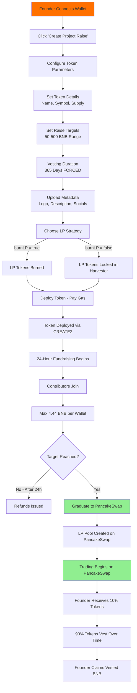
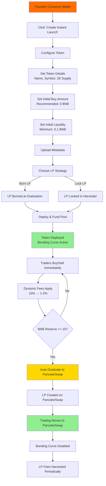
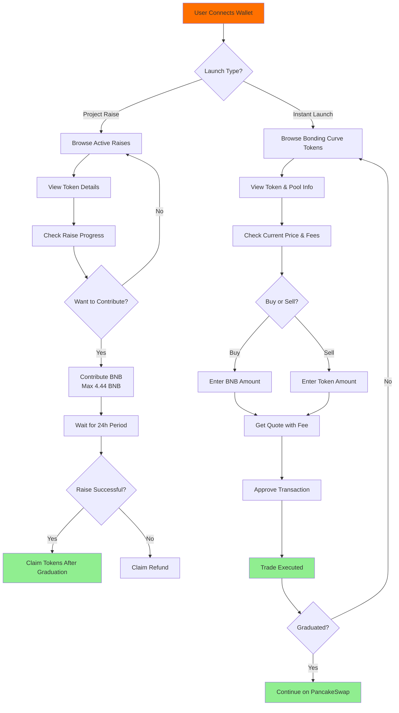
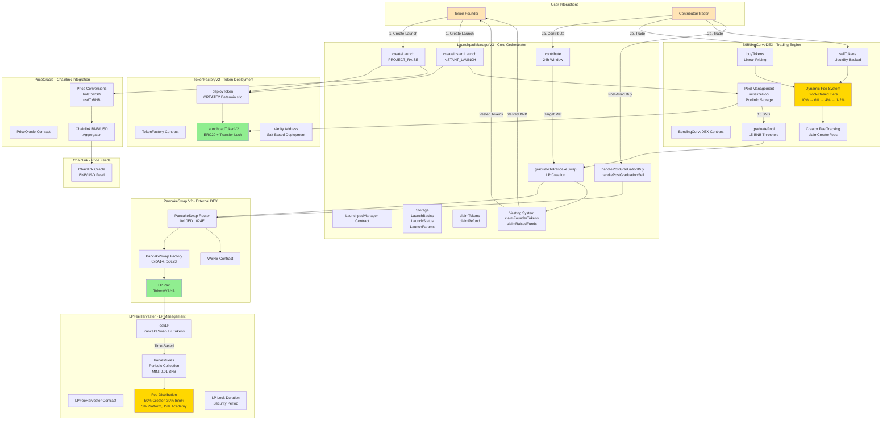
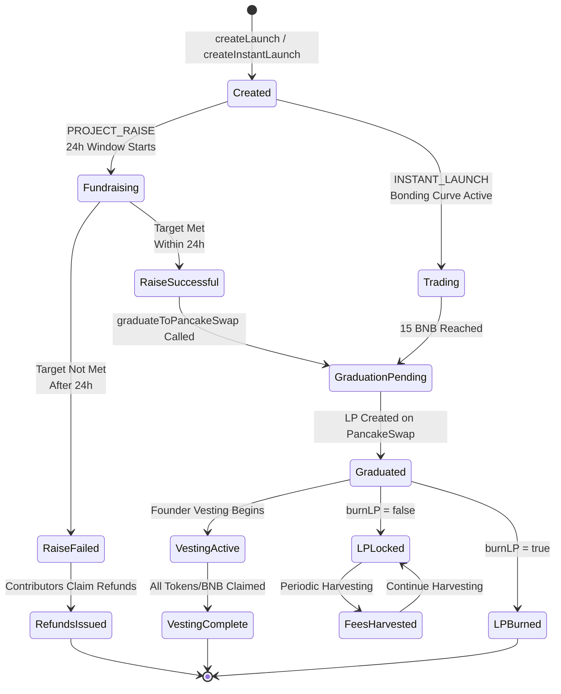

# SafuPad - Token Launchpad Platform

Smart contract system for fair token launches **deployed on BNB Chain** (BNB Smart Chain). Features bonding curve mechanics, automatic PancakeSwap integration, and two launch modes: Project Raise and Instant Launch.

## Deployment Information

**Primary Network**: BNB Chain (BNB Smart Chain)

- **BSC Mainnet**: Chain ID 56
- **BSC Testnet**: Chain ID 97

All contracts are designed specifically for deployment on BNB Chain, leveraging PancakeSwap V2 for automatic liquidity provision and BNB as the base trading pair.

## Overview

safupad is a decentralized token launchpad platform on BNB Chain that provides:

- **Fair Launch Mechanisms**: Two launch modes for different project needs
- **Bonding Curve DEX**: Dynamic pricing based on supply
- **Automatic Graduation**: Seamless migration to PancakeSwap on BSC
- **Anti-Bot Protection**: Built-in safeguards against manipulation
- **BNB-Denominated Launches**: All token launches priced in BNB

## Features

### Two Launch Modes

#### 1. Project Raise (Fixed-Price Sale)

- 24-hour contribution period
- Fixed token price in BNB
- Minimum/maximum contribution limits
- Refunds if targets not met
- Automatic PancakeSwap listing after raise

#### 2. Instant Launch (Bonding Curve)

- Immediate trading on bonding curve DEX
- Dynamic pricing based on supply
- 10% → 1-2% fee schedule
- Graduates to PancakeSwap at 15 BNB threshold
- Real-time price discovery

### PancakeSwap Integration on BSC

Automatic graduation to PancakeSwap V2 when conditions met:

- Liquidity pool created on PancakeSwap (BSC)
- LP tokens locked for security
- 1% platform fee on graduation
- Seamless transition from bonding curve to AMM

### Token Vesting

- **365-day forced vesting** (MIN_VESTING_DURATION = MAX_VESTING_DURATION in contract)
- Founder tokens: 20% immediate, 10% vested over 365 days
- BNB proceeds: 20% immediate, 60% vested over 365 days
- On-chain vesting with monthly claims
- Transparent unlock periods

## User Journey

### Project Raise Flow



### Instant Launch Flow



### Contributor/Trader Journey



## Smart Contract Architecture

### System Overview



### State Transitions



### Fee Flow Diagram

```mermaid
graph TD
    subgraph "Trading Fees - Bonding Curve"
        T1[User Trades on Bonding Curve]
        T1 --> F1{Fee Tier?}

        F1 -->|Blocks 0-20| FEE1[10% Fee<br/>Anti-Bot Protection]
        F1 -->|Blocks 21-50| FEE2[6% Fee]
        F1 -->|Blocks 51-100| FEE3[4% Fee]
        F1 -->|Block 100+| FEE4[1-2% Fee<br/>1% PROJECT_RAISE<br/>2% INSTANT_LAUNCH]

        FEE1 --> SPLIT
        FEE2 --> SPLIT
        FEE3 --> SPLIT
        FEE4 --> SPLIT

        SPLIT[Fee Split] --> CREATOR[Creator Wallet<br/>Claimable]
    end

    subgraph "Graduation Fees - 1%"
        G1[graduateToPancakeSwap Called]
        G1 --> G2[Total BNB in Pool]
        G2 --> G3[1% Platform Fee Deducted]
        G3 --> G4[99% Goes to LP]

        G3 --> PLATFORM1[Platform Fee Address]
        G4 --> PANCAKE[PancakeSwap LP]
    end

    subgraph "LP Fee Harvesting"
        H1[LP Locked in Harvester]
        H1 --> H2[PancakeSwap Collects Trading Fees]
        H2 --> H3[Harvester Calls removeLiquidity]
        H3 --> H4{Fee >= 0.01 BNB?}

        H4 -->|Yes| H5[Harvest Successful]
        H4 -->|No| H6[Wait for More Fees]

        H5 --> H7[Split Harvested Fees]
        H7 --> CREATOR2[50% to Creator]
        H7 --> INFOFI[30% to InfoFi]
        H7 --> PLATFORM2[5% to Platform]
        H7 --> ACADEMY[15% to Academy]
    end

    subgraph "Post-Graduation Trading"
        P1[User Buys Post-Graduation]
        P1 --> P2[1% Platform Fee on BNB]
        P2 --> P3[Swap via PancakeSwap]

        P4[User Sells Post-Graduation]
        P4 --> P5[2% Platform Fee on Tokens]
        P5 --> P6[Swap via PancakeSwap]

        P2 --> PLATFORM3[Platform Fee Address]
        P5 --> PLATFORM3
    end

    style CREATOR fill:#90EE90
    style CREATOR2 fill:#90EE90
    style INFOFI fill:#ADD8E6
    style ACADEMY fill:#DDA0DD
    style PLATFORM1 fill:#FFD700
    style PLATFORM2 fill:#FFD700
    style PLATFORM3 fill:#FFD700
```



## Smart Contracts

### Core Contracts

#### LaunchpadManagerV2.sol (LaunchpadManagerV3)

Main launchpad coordinator deployed on BNB Chain.

**Key Functions**:

- `createProjectRaise()` - Create fixed-price raise
- `createInstantLaunch()` - Deploy bonding curve launch
- `contribute()` - Participate in raises (pay with BNB)
- `claimTokens()` - Claim purchased tokens
- `graduateToPancakeSwap()` - Migrate to PancakeSwap on BSC

**Features**:

- BNB-based contributions (50-500 BNB ranges)
- Integration with PancakeSwap Router on BSC
- Platform fee collection (1%)
- Emergency pause functionality

#### BondingDEX.sol (BondingCurveDEX)

Bonding curve automated market maker on BNB Chain.

**Bonding Curve Formula**:

```
price = basePrice + (currentSupply * priceIncrement)
```

**Fee Schedule**:

- Initial: 10%
- Gradual reduction to 1-2%
- Dynamic based on volume
- Fees collected in BNB

**Graduation Threshold**: 15 BNB in liquidity triggers PancakeSwap migration

#### TokenFactoryV2.sol

ERC20 token factory for launched tokens on BSC.

**Creates**: LaunchpadTokenV2 instances

- Standard ERC20 with transfer locks
- Unlock after raise completion
- Metadata and branding support

#### LPFeeHarvester.sol

LP token management and fee harvesting on BSC.

**Features**:

- Locks PancakeSwap LP tokens
- Harvests trading fees
- Distributes rewards to platform

#### PriceOracle.sol

Chainlink integration for BNB/USD pricing on BSC.

**Purpose**:

- USD-denominated pricing converted to BNB
- Uses Chainlink BNB/USD feed on BNB Chain
- Accurate price discovery for launches

## Deployed Contracts

### BSC Mainnet (Chain ID: 56)

- **LaunchpadManager**: `0x93f526689Ddccd35882b7Ec3C79F40e70fe3014d`
- **BondingCurveDEX**: `0x4647a56f1B1624443fC084aE4A54208889495874`
- **TokenFactory**: `0xFd66bB7a03F911302f807d0CEFdEfb7eE88b385a`
- **PriceOracle**: `0x0f452bE1BE3cefE23Bfe2D1f1831b83073471699`
- **LPFeeHarvester**: `0xAd0edb8cf7Cd9BF8ca11Fc8A9593c15a922D8870`
- **PancakeSwap Router**: `0x10ED43C718714eb63d5aA57B78B54704E256024E`
- **PancakeSwap Factory**: `0xcA143Ce32Fe78f1f7019d7d551a6402fC5350c73`

## Technology Stack

- **Blockchain**: BNB Smart Chain (BSC)
- **Solidity**: 0.8.28
- **Framework**: Hardhat 3.0.7 (Beta)
- **Testing**: Mocha, Chai, Hardhat Chai Matchers
- **Libraries**: OpenZeppelin Contracts 5.4.0
- **DEX**: PancakeSwap V2 on BSC
- **Price Feeds**: Chainlink oracles on BSC
- **Verification**: BSCScan

## Getting Started

### Prerequisites

- Node.js 18+
- Hardhat 3.x
- BNB Chain wallet with testnet/mainnet BNB
- BSCScan API key for verification

### Installation

```bash
cd SafuPad
npm install
```

### Environment Configuration

Create `.env` file:

```bash
# BNB Chain Configuration
BSC_RPC_URL=https://bsc-dataseed.binance.org/
BSC_TESTNET_RPC_URL=https://data-seed-prebsc-1-s1.binance.org:8545/

# Deployer Wallet
PRIVATE_KEY=your_private_key_here

# BSCScan Verification
BSCSCAN_API_KEY=your_bscscan_api_key

# PancakeSwap Addresses on BSC
PANCAKE_ROUTER=0x10ED43C718714eb63d5aA57B78B54704E256024E  # BSC Mainnet
PANCAKE_FACTORY=0xcA143Ce32Fe78f1f7019d7d551a6402fC5350c73  # BSC Mainnet

# Chainlink Price Feed on BSC
BNB_USD_ORACLE=chainlink_bnb_usd_feed_address_on_bsc

# Platform Configuration
PLATFORM_FEE_RECIPIENT=your_fee_collection_address
```

### Compile Contracts

```bash
npx hardhat compile
```

### Run Tests

```bash
npx hardhat test
```

Run Solidity tests only:

```bash
npx hardhat test solidity
```

Run TypeScript tests only:

```bash
npx hardhat test mocha
```

### Run Tests with Gas Reporting

```bash
REPORT_GAS=true npx hardhat test
```

## Deployment to BNB Chain

### Deploy to BSC Testnet

```bash
npx hardhat run scripts/deploy.ts --network bscTestnet
```

### Deploy to BSC Mainnet

```bash
npx hardhat run scripts/deploy.ts --network bsc
```

### Verify on BSCScan

```bash
npx hardhat verify --network bsc <CONTRACT_ADDRESS> <CONSTRUCTOR_ARGS>
```

## Hardhat Configuration

The project uses Hardhat 3 Beta with BNB Chain networks configured:

```typescript
// hardhat.config.ts
networks: {
  bsc: {
    url: process.env.BSC_RPC_URL || "https://bsc-dataseed.binance.org/",
    chainId: 56,
    accounts: [process.env.PRIVATE_KEY!],
  },
  bscTestnet: {
    url: process.env.BSC_TESTNET_RPC_URL || "https://data-seed-prebsc-1-s1.binance.org:8545/",
    chainId: 97,
    accounts: [process.env.PRIVATE_KEY!],
  },
}
```

## Usage Examples

### Create Project Raise

```javascript
const tx = await launchpadManager.createProjectRaise(
  "MyToken",
  "MTK",
  ethers.parseEther("50"), // 50 BNB goal
  ethers.parseEther("0.01"), // Min contribution
  ethers.parseEther("4.44"), // Max contribution
  tokenAmount,
  founderAmount,
  vestingSchedule
);
```

### Create Instant Launch

```javascript
const tx = await launchpadManager.createInstantLaunch(
  "MyToken",
  "MTK",
  ethers.parseEther("0.001"), // Base price in BNB
  ethers.parseEther("0.0001"), // Price increment
  tokenAmount,
  founderAmount,
  vestingSchedule
);
```

### Contribute to Raise

```javascript
const tx = await launchpadManager.contribute(launchId, {
  value: ethers.parseEther("1"), // 1 BNB contribution
});
```

### Buy on Bonding Curve

```javascript
const tx = await bondingDEX.buy(launchId, minTokensOut, {
  value: ethers.parseEther("0.5"), // 0.5 BNB
});
```

### Graduate to PancakeSwap

Once 15 BNB liquidity threshold is reached:

```javascript
const tx = await launchpadManager.graduateToPancakeSwap(launchId);
```

This creates a PancakeSwap V2 pair on BSC and migrates liquidity.

## PancakeSwap Integration Details

### Automatic Liquidity Migration

When a launch graduates:

1. Bonding curve liquidity withdrawn
2. PancakeSwap pair created (Token/WBNB)
3. Liquidity added to PancakeSwap on BSC
4. LP tokens locked via LPFeeHarvester
5. Trading continues on PancakeSwap

### LP Token Locking

- LP tokens locked for minimum period
- Harvester collects PancakeSwap trading fees
- Fees distributed to platform and project

## Security Features

1. **Reentrancy Protection**: OpenZeppelin ReentrancyGuard
2. **Access Control**: Ownable and role-based permissions
3. **Pause Mechanism**: Emergency pause functionality
4. **Price Oracle Validation**: Chainlink integration for accurate BNB/USD
5. **Transfer Locks**: Tokens locked during raise period
6. **Vesting Enforcement**: On-chain vesting for founder tokens

## Gas Optimization

Contracts optimized for BSC's gas model:

- Efficient storage patterns
- Batch operations where possible
- Optimized for 10000 runs

Estimated gas costs on BSC (very affordable):

- Create Launch: ~2-3M gas
- Contribute: ~150K gas
- Buy on Curve: ~200K gas
- Graduate to PancakeSwap: ~500K gas

## Testing on BSC Testnet

1. Get testnet BNB from [faucet](https://testnet.bnbchain.org/faucet-smart)
2. Deploy contracts to BSC Testnet
3. Test with testnet PancakeSwap addresses
4. Verify on testnet.bscscan.com

## Network Information

### BSC Mainnet

- **Chain ID**: 56
- **RPC**: https://bsc-dataseed.binance.org/
- **Explorer**: https://bscscan.com
- **PancakeSwap Router**: 0x10ED43C718714eb63d5aA57B78B54704E256024E
- **PancakeSwap Factory**: 0xcA143Ce32Fe78f1f7019d7d551a6402fC5350c73

### BSC Testnet

- **Chain ID**: 97
- **RPC**: https://data-seed-prebsc-1-s1.binance.org:8545/
- **Explorer**: https://testnet.bscscan.com
- **Faucet**: https://testnet.bnbchain.org/faucet-smart

## Integration with Safuverse

safupad integrates with other Safuverse components on BNB Chain:

- **SafuAcademyy**: Token economics education courses
- **Safucard**: Project scorecard NFTs
- **SafuAgents**: AI-powered launch analytics

## Contributing

1. Fork the repository
2. Create a feature branch
3. Write tests for new features
4. Test on BSC Testnet
5. Submit a pull request

## Hardhat 3 Beta Features

This project uses Hardhat 3 Beta:

- Improved TypeScript support
- Better error messages
- Enhanced testing capabilities
- Faster compilation

Learn more: [Hardhat 3 Beta Guide](https://hardhat.org/docs/getting-started#getting-started-with-hardhat-3)

Feedback: [Hardhat 3 Beta Telegram](https://hardhat.org/hardhat3-beta-telegram-group)

## License

MIT License

## Support

- **Email**: info@level3labs.fun
- **GitHub Issues**: For bug reports and feature requests
- **BNB Chain Docs**: https://docs.bnbchain.org
- **PancakeSwap Docs**: https://docs.pancakeswap.finance

---

**Deployed on BNB Chain and Powered by .safu** - Fair token launches with bonding curves and automatic PancakeSwap integration on BNB Smart Chain.
